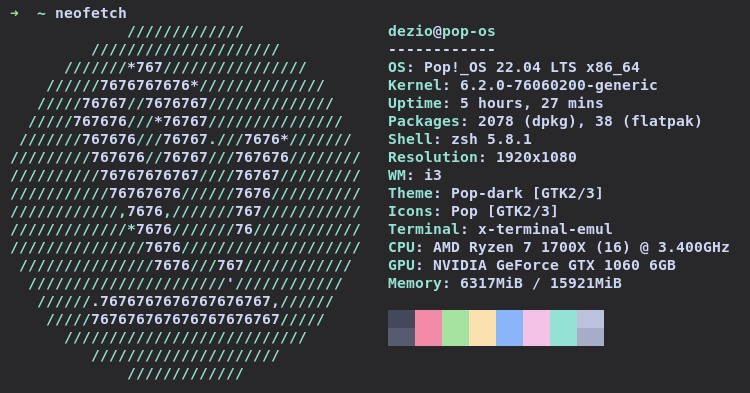

## Identificación: Sesión 3, Ejercicios 3.1 y 4.1
## Estudiante: Bruno De Simone, 4914555-0
## Problema:
Se desea estimar el volumen de una región R de [0, 1], 6 dimensiones, definida por todos los puntos de la hiper-esfera de centro (0.45, 0.5, 0.6, 0.6, 0.5, 0.45) y radio 0.35, que ademas cumplan las restricciones siguientes: 3x1 + 7x4 ≤ 5; x3 +x4 ≤ 1; x1 −x2 −x5 +x6 ≥ 0.

Luego se pide que se calcule el mínimo numero de repeticiones según varios teoremas, lo que se calculo es el mínimo de repeticiones que garanticen cierta probabilidad de encontrar un buen estimador con una error acotado.

## Solución:
Se implementó un algoritmo en el cual para cada repetición, a partir de un generador de valores de una distribución normal, se genera un valor para cada dimensión a modo de generar un punto de la región . Una vez obtenido el punto se fija si cumple con las restricciones estipuladas y finalmente si pertenece a la hiper-esfera. En caso de cumplir todos los requisitos se le suma 1 a un acumulador que al final dividimos por el numero de repeticiones para obtener la estimación del volumen. En caso de fallar alguno de los requisitos se pasa a la siguiente iteracion.

### Optimización
No se realizaron optimizaciones.

### Lenguaje y Biblioteca
La implementación del algoritmo fue hecha en el lenguaje [Rust](https://www.rust-lang.org/es), el mismo es un lenguaje de bajo nivel con velocidad comparable con C++ pero permite un manejo seguro de memoria. Para la generación de las variables aleatorios se utilizo la biblioteca [rand](https://docs.rs/rand/latest/rand/), se utiliza la feature std_rng la cual permite crear un generador pseudorandom number generator (PRNG) seguro, determinista con una seed representada por un numero natural de 64bits. El algoritmo utilizado por el generador es ChaCha12.
Ademas para en el calculo del peor caso del Teorema de Limite Central se utilizo la biblioteca [statrs](https://docs.rs/statrs/latest/statrs/distribution/struct.Normal.html)
que nos permite obtener valores para la función de inverso de distribución normal.

## Resultado computacional
### Plataforma:
Las pruebas fueros realizadas en una computadora con:
<ul>
<li>CPU: AMD Ryzen 7 1700x a 3.4 GHz</li>
<li>RAM: 16 gb DDR4 3200mhz</li>
<li>OS: PopOs (Ubuntu)</li>
<li>Semilla: 1848872944</li>
</ul>



### Resultados

#### Peores Casos
Cota de Error: 0.01
Delta: [0.001, 0.01, 0.05]

Chebyshev: [2500000.0, 249999.99999999997, 49999.99999999999]
LCT: [27068.91542665734, 16587.24150255304, 9603.64705173531]
Hoeffding: [38004.51229771041, 26491.58683274018, 18444.39727056968]

#### 10000 Repeticiones volumen
Estimación: 0.0102
Varianza: 0.000001009697
Desviación Estándar: 0.0010048369
Tiempo: 181.409µs

Como vemos dados los siguientes teoremas el único con el que esta cercano a considerarse una "un n suficiente" es con el Teorema de Limite Central. Dado que TLC es considerado una medida optimista consideramos que no es un numero suficiente de repeticiones. Ademas se encontró que con algunas semillas ninguno de los puntos caía dentro del volumen que se quiere calcular. Considero que uno de los errores que sufre TLC es que lamba es cercano a 0, se ve mejor a continuación.

#### 1000000 Repeticiones volumen
Estimación: 0.009567
Varianza: 0.000000009475482
Desviación Estándar: 0.00009734208
Tiempo: 17.600286ms

Como vemos en el calculo de los peores casos este numero de repeticiones nos ofrece una garantía del 99% con error de 0,01 para todos los casos. Parecería un buen numero de repeticiones peros dado el volumen calculado para el volumen un error de 0,01 en términos relativos es un error que parece grande.

#### Volumen de la Hiper-esfera
Volumen de la hipersfera: 0.00949962, el calculo realizado coincide con la fuente dada por la letra y con cálculos de otras paginas web.

### Ejecución
el comando de ejecución para el binario compilado es:
```bash
Usage: entrega2 [OPTIONS] --ejercicio <EJERCICIO>

Options:
  -n, --repeticiones <REPETICIONES>  cantidad de replicaciones 'n' a realizar [default: 1000]
  -e, --ejercicio <EJERCICIO>        ejercicio a ejecutar (1 o 2)
      --nr                           eliminar (no) restricciones
  -h, --help                         Print help
```
Código disponible en https://github.com/b4-io/MMC