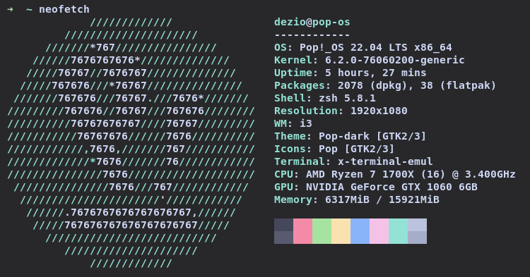

## Identificación: Sesión 2, Ejercicio 2.1
## Estudiante: Bruno De Simone, 4914555-0
## Problema:
Se idealiza una montana como un cono inscrito en una región cuadrada de lado 1 km. La base de la monta˜na es circular, con centro en (0.5, 0.5) y radio r = 0.4km, y la altura ****es H = 8km. La altura de cada punto (x, y) de la montania esta dada por la función ![[Pasted image 20230326114542.png]], en la zona definida por el circulo, y 0 fuera del círculo. El volumen total de la monta˜na (en km cúbicos) puede verse como la integral de la función altura en la región.

### Tareas
| Estimacion | Varianza | Intervalo | Tiempo | Repeticiones |
        |----|----|----|----|----|
        | 1.3385398 | 0.0000035470912 | [1.3348485, 1.3422312] | 35.678524ms | 1000000 |
        | 1.3354521 | 0.0000002407254 | [1.3344904, 1.3364137] | 249.601045ms | 13626005 |
### Dependencias


## Solución:
Se implementó un algoritmo en el cual para cada repetición, se obtiene un estimado de la duración de todas las tareas, y luego según el grafo de dependencia se calcula el tiempo hasta que cada tarea este finalizada (ej: el tiempo T2_total = T1 + T2 ya que T2 depende de T1 para comenzar). En caso de que una tarea dependa de varias el tiempo de comienzo de la misma es el tiempo máximo total de las dependencias. 
Al final cada repetición se le suma la estimación obtenido a un acumulador de la estimación y el cuadrado de la estimación al acumulador de la desviación estándar.
Al final de todas las repeticiones se realiza el calculo de la estimación y la desviación estándar. 

### Optimización
La única optimización realizada fue eliminar la dependencia de T10 a T7 ya que T10 depende de T8 la cual depende de T7. Además se sabe que T10 es la ultima en finalizar.

### Lenguaje y Biblioteca
La implementación del algoritmo fue hecha en el lenguaje [Rust](https://www.rust-lang.org/es), el mismo es un lenguaje de bajo nivel con velocidad comparable con C++ pero permite un manejo seguro de memoria. Para la generación de las variables aleatorios se utilizo la biblioteca [rand](https://docs.rs/rand/latest/rand/), se utiliza la feature std_rng la cual permite crear un generador pseudorandom number generator (PRNG) seguro, determinista con una seed representada por un numero natural de 64bits. El algoritmo utilizado por el generador es ChaCha12.

## Resultado computacional
### Plataforma:
Las pruebas fueros realizadas en una computadora con:
<ul>
<li>CPU: AMD Ryzen 7 1700x a 3.4 GHz</li>
<li>RAM: 16 gb DDR4 3200mhz</li>
<li>OS: PopOs (Ubuntu)</li>
<li>Semilla: 24242</li>
</ul>



### Resultados
<table><thead><tr>
                 <td>Repeticiones</td>
                 <td>Estimacion</td>
                 <td>Desviacion Estandar</td>
                 <td>Tiempo</td>
             </tr></thead><tbody>
<tr>
                 <td>10</td>
                 <td>171.13961256727094</td>
                 <td>2.1679395079361674</td>
                 <td>4.338µs</td>
             </tr>
<tr>
                 <td>100</td>
                 <td>169.22178866730155</td>
                 <td>1.0728476997084384</td>
                 <td>8.716µs</td>
             </tr>
<tr>
                 <td>1000</td>
                 <td>168.74070069210356</td>
                 <td>0.3270661673231003</td>
                 <td>82.935µs</td>
             </tr>
<tr>
                 <td>10000</td>
                 <td>168.6075364086792</td>
                 <td>0.10215507031677226</td>
                 <td>826.605µs</td>
             </tr>
<tr>
                 <td>100000</td>
                 <td>168.52839752748076</td>
                 <td>0.032375891782190844</td>
                 <td>8.851423ms</td>
             </tr>
<tr>
                 <td>1000000</td>
                 <td>168.5663234294353</td>
                 <td>0.010280489558464443</td>
                 <td>84.839642ms</td>
             </tr>
<tr>
                 <td>10000000</td>
                 <td>168.56837632343</td>
                 <td>0.003251949873756085</td>
                 <td>832.531958ms</td>
             </tr>
<tr>
                 <td>100000000</td>
                 <td>168.56498413608753</td>
                 <td>0.0010283063800508513</td>
                 <td>8.437807401s</td>
             </tr>
<tr>
                 <td>1000000000</td>
                 <td>168.56505261275603</td>
                 <td>0.00032520694893927344</td>
                 <td>84.659053474s</td>
             </tr>
</tbody></table>

Se ve observa que la estimación para la finalización de la obra es 168.565, ademas se ve como a medida que el numero de repeticiones se va multiplicando por 10 la desviación estándar baja en razón de raíz cuadrada de 10 y el tiempo aumenta en razón de 10 ya que es un algoritmo de orden n (lineal)

### Ejecución
el comando de ejecución para el binario compilado es:
```bash
Usage: entrega1 [OPTIONS]

Options:
  -r, --repeticiones <REPETICIONES>  cantidad de replicaciones 'n' a realizar [default: -1]
  -t, --tabla                        generar tabla de resultados
  -h, --help                         Print help
```
En caso de no especificar el numero de repeticiones se ejecutan todas las repeticiones reportadas.
